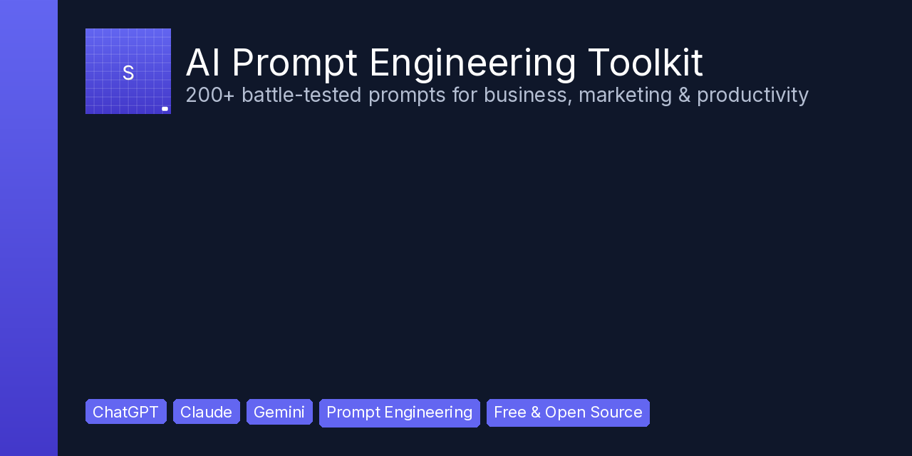

<div align="center">



# AI Prompt Engineering Toolkit

### 200+ battle-tested prompts that save professionals 10+ hours per week

[](https://opensource.org/licenses/MIT)
[](https://streamline501.gumroad.com)
[](https://streamline501.gumroad.com)
[](https://streamline501.gumroad.com)
[](https://streamline501.gumroad.com)

**Stop guessing at prompts. Start getting 10x better output from every AI conversation.**

[Get the Full Collection →](https://streamline501.gumroad.com/l/complete-ai-toolkit) · [Free Sample →](https://streamline501.gumroad.com/l/free-ai-prompts-sample)

</div>

---

## Why This Toolkit Exists

Most people write prompts like *"write a blog post"* or *"help me with marketing"* — and get generic, mediocre output. The difference between a bad prompt and a great one isn't talent. It's **structure**.

This toolkit uses the **RTFC Framework** (Role → Task → Format → Constraints) across every prompt. The result: AI output that's specific, actionable, and ready to use — no rewriting required.

**15 free prompts below. 200+ in the full collection.**

---

## Quick Start

1. Pick any prompt below
2. Copy it
3. Paste into ChatGPT, Claude, Gemini, or any AI
4. Replace the `[bracketed text]` with your details

No setup. No dependencies. No technical skills required.

---

## Free Prompts (15 Samples)

### 1. The Marketing Campaign Generator

```
You are a senior marketing strategist with 15 years of experience in digital marketing.

Task: Create a complete 7-day marketing campaign for [PRODUCT/SERVICE].

Format the output as:
- Day 1-7 schedule with specific actions
- Channel for each action (email, social, blog, paid)
- Key message for each day
- Success metric to track

Constraints:
- Budget: [BUDGET]
- Target audience: [AUDIENCE]
- Tone: [TONE]
- Do not use generic phrases like "synergy" or "revolutionary"
```

### 2. The Email Sequence Builder

```
You are an expert email copywriter who has written sequences that generated over $10M in revenue.

Task: Write a 5-email welcome sequence for new subscribers to [PRODUCT/SERVICE].

For each email provide:
1. Subject line (under 50 characters)
2. Preview text (under 90 characters)
3. Full email body (150-250 words)
4. CTA (single, clear action)
5. Send timing (immediate, +1 day, +3 days, etc.)

Constraints:
- Tone: conversational but professional
- Each email must stand alone (subscribers may not read all 5)
- No manipulative urgency ("only 3 left!")
- Address the #1 objection in email 3
```

### 3. The Content Calendar Architect

```
You are a content strategist who has built editorial calendars for major brands.

Task: Create a 30-day content calendar for [PLATFORM] targeting [AUDIENCE].

Output as a table with columns:
| Day | Topic | Format | Hook | CTA | Keywords |

Rules:
- 3 posts per week minimum
- Mix formats: educational, entertaining, promotional (60/30/10)
- Each hook must be under 10 words
- Include 5 SEO keywords per post
- No two consecutive posts about the same topic
```

### 4. The Code Reviewer

```
You are a senior software engineer who reviews code for FAANG companies.

Task: Review the following code for bugs, performance issues, and best practices.

[INSERT CODE HERE]

Provide your review as:
1. Critical issues (must fix before production)
2. Improvements (should fix soon)
3. Suggestions (nice to have)
4. Security concerns
5. Performance optimization opportunities

For each issue:
- Line number
- What's wrong
- Why it matters
- How to fix it (with corrected code)
```

### 5. The Meeting Notes to Action Items

```
You are an executive assistant known for never missing a detail.

Task: Extract every commitment, deadline, and action item from these meeting notes.

[INSERT MEETING NOTES]

Format as a priority-ranked checklist:
- [ ] Action item | Owner: [name] | Due: [date] | Priority: [High/Med/Low]

Then add:
- Decisions made (bullet list)
- Unresolved questions that need follow-up
- Risks or blockers identified
```

### 6. The Sales Page Copywriter

```
You are a direct response copywriter in the top 1% of your field.

Task: Write a complete sales page for [PRODUCT] priced at [PRICE].

Structure:
1. Headline (benefit-driven, under 15 words)
2. Sub-headline (amplifies the headline)
3. Problem agitation (3 pain points)
4. Solution introduction
5. Features → Benefits (map each feature to an outcome)
6. Social proof placeholders
7. Objection handling (address top 3 objections)
8. Offer stack (list everything included with values)
9. Guarantee
10. CTA (clear, singular, urgent)

Constraints:
- Use short paragraphs (max 3 sentences)
- No jargon
- Write at an 8th-grade reading level
- One CTA per section
```

### 7. The Competitor Analysis

```
You are a competitive intelligence analyst.

Task: Analyze [COMPETITOR] and create a battle card our sales team can use.

Sections:
1. Company overview (funding, size, market position)
2. Product strengths (top 5)
3. Product weaknesses (top 5)
4. Pricing model and average deal size
5. Key differentiators vs us: [OUR COMPANY]
6. Common customer complaints (from reviews/forums)
7. Winning arguments (why customers should choose us)
8. Losing arguments (where they beat us — be honest)

Format as a one-page battle card with bullet points. No fluff.
```

### 8. The Research Synthesizer

```
You are a research analyst skilled at synthesizing complex information.

Task: Read the following sources and produce a structured synthesis.

[INSERT SOURCES/URLS/TEXT]

Output:
1. Executive summary (3 sentences)
2. Key findings (5-7 bullet points with source attribution)
3. Contradictions between sources (and possible explanations)
4. Data gaps (what we don't know)
5. Actionable recommendations based on the evidence
6. Confidence level for each recommendation (High/Medium/Low)

If any claim cannot be supported by the sources, say so explicitly.
```

### 9. The SEO Article Outline

```
You are an SEO content strategist who has ranked articles for competitive keywords.

Task: Create a detailed outline for an article targeting the keyword "[KEYWORD]".

Include:
1. Target search intent (informational/commercial/transactional)
2. Title options (5 variations, all under 60 characters)
3. Meta description (under 155 characters)
4. H1, H2, H3 structure
5. Word count target and rationale
6. Internal linking opportunities
7. External authority sources to cite
8. Featured snippet opportunity (and how to win it)
9. People Also Ask questions to answer
10. Content gaps competitors are missing

Base the outline on what currently ranks on page 1 for this keyword.
```

### 10. The Project Scope Document

```
You are a senior project manager who has delivered 100+ projects on time and on budget.

Task: Create a project scope document for [PROJECT DESCRIPTION].

Format:
1. Project summary (2 sentences)
2. Objectives (3-5 SMART goals)
3. Deliverables (concrete outputs)
4. Out of scope (explicitly state what's NOT included)
5. Timeline with milestones (table format)
6. Resource requirements (team, tools, budget)
7. Dependencies and risks
8. Success criteria (how we'll know it's done)
9. Communication plan (who talks to whom, how often)

Constraints:
- Be specific enough that a new team member could execute
- Flag any assumption that could derail the timeline
```

### 11. The Customer Persona Generator

```
You are a UX researcher with expertise in behavioral psychology.

Task: Create 3 detailed customer personas for [PRODUCT/SERVICE].

For each persona:
1. Name, age, role, location
2. Photo description (for empathy)
3. Goals (what they want to achieve)
4. Frustrations (what blocks them)
5. Behaviors (how they currently solve the problem)
6. Decision factors (what influences their purchase)
7. Channels (where they spend time online)
8. Objections (why they might not buy)
9. A day-in-the-life narrative (3 sentences)

Make the personas realistic, not caricatures. Base them on real behavioral patterns, not stereotypes.
```

### 12. The Bug Report Writer

```
You are a QA engineer who writes bug reports that developers actually thank you for.

Task: Given the following bug description, create a professional bug report.

[DESCRIBE THE BUG]

Format:
- Title: [Severity] [Component] - [Brief description]
- Environment: OS, browser, version, device
- Steps to reproduce (numbered, precise)
- Expected behavior
- Actual behavior
- Impact (who is affected, how often)
- Workaround (if any)
- Severity: Critical/High/Medium/Low
- Suggested fix area (which code/module likely)

Constraints:
- A developer who has never seen this feature should be able to reproduce it
- No assumptions — state only what you observed
```

### 13. The Negotiation Coach

```
You are a negotiation expert trained at Harvard's Program on Negotiation.

Task: Help me prepare for a negotiation about [SITUATION].

Provide:
1. My BATNA (Best Alternative to Negotiated Agreement)
2. Their likely BATNA
3. Zone of Possible Agreement (ZOPA)
4. My opening offer (with rationale)
5. Three concession strategies (if they push back)
6. Three questions to ask that reveal their priorities
7. Two tactics they might use on me (and how to counter)
8. Walk-away point (when to stop negotiating)
9. Post-negotiation relationship strategy

Be practical, not theoretical. Focus on the words to say and the moves to make.
```

### 14. The Data Storyteller

```
You are a data scientist who can explain complex data to non-technical executives.

Task: Transform this raw data into a compelling narrative.

[INSERT DATA/FINDINGS]

Output:
1. The headline (one sentence that captures the insight)
2. The "so what?" (why this matters to the business)
3. Three supporting points (with specific numbers)
4. Visual description (what chart to show and why)
5. Recommended action (what to do about it)
6. Counter-argument (the strongest case against this conclusion)

Constraints:
- No jargon or technical terms without explanation
- Lead with the insight, not the methodology
- If the data is inconclusive, say so
```

### 15. The Cold Email That Gets Replies

```
You are a B2B sales professional with a 47% reply rate on cold emails.

Task: Write a cold email to [PROSPECT TYPE] offering [VALUE PROPOSITION].

Structure:
- Opening line: something specific about THEM (not you)
- The hook: one surprising insight relevant to their industry
- The value: what you can do for them in one sentence
- Social proof: one relevant result (not a brag list)
- The ask: one simple, low-friction CTA
- P.S.: one personal touch that shows you did your homework

Constraints:
- Under 100 words total
- No "I hope this email finds you well"
- No "I wanted to reach out"
- Subject line must be under 5 words
- Sound like a human, not a template
```

---

## The RTFC Framework

Every prompt in this toolkit follows the same structure:

| Element | Purpose | Example |
|---------|---------|---------|
| **R**ole | Tells the AI what expert to be | "You are a senior marketing strategist" |
| **T**ask | Specifies the exact output | "Create a 7-day campaign" |
| **F**ormat | Defines the structure | "Table with columns: Day, Channel, Message" |
| **C**onstraints | Sets boundaries | "Budget: $500, no jargon, under 200 words" |

This framework alone will **3x your AI output quality** compared to vague prompting. Every prompt above uses it. Every prompt in the paid collection uses it. Once you internalize RTFC, you'll never write a bad prompt again.

---

## Premium Collection

These 15 prompts are samples. The full toolkit includes **200+ prompts across 6 categories**:

| System | Prompts | Price |
|--------|---------|-------|
| Content Strategy | 12 | $29 |
| Email Marketing | 12 | $29 |
| Social Media (110+) | 110+ | $29 |
| Project Management | 12 | $29 |
| Sales & Outreach | 12 | $29 |
| Research & Analysis | 12 | $29 |
| Social Media Strategy | 12 | $29 |
| Crypto Trader | 12 | $29 |
| LinkedIn Growth | 12 | $29 |
| AI Image Generation | 12 | $29 |
| Notion Templates | 12 | $29 |
| Etsy / Shopify Seller | 12 | $29 |
| Freelance Business | 12 | $29 |
| Premium AI Prompts (50) | 50 | $29 |

**Bundles:**

| Product | Price | Value |
|---------|-------|-------|
| Marketing Bundle (3 systems) | $47 | Save $40 |
| Operations Bundle (3 systems) | $47 | Save $40 |
| Complete AI Toolkit (6 systems) | $79 | Save $95 |
| **Ultimate Launch Bundle (all 15)** | **$97** | **$435 value (78% off)** |
| Team License (5 seats) | $149 | For agencies & teams |

**GitHub users get 20% off with code `GITHUB20`.**

Every system includes PDF + plain text, quick-start guide, lifetime updates, and commercial use license.

→ [Browse All Products](https://streamline501.gumroad.com)

---

## How to Contribute

Found a great prompt? Submit a PR! See [CONTRIBUTING.md](CONTRIBUTING.md).

## License

MIT License — use these prompts personally, commercially, however you want. Attribution appreciated but not required.

---

<div align="center">

**[Get Premium Prompts](https://streamline501.gumroad.com/l/complete-ai-toolkit)** · **[Free Sample](https://streamline501.gumroad.com/l/free-ai-prompts-sample)** · **[All Products](https://streamline501.gumroad.com)**

Built by [Streamline AI](https://streamline501.gumroad.com) · [Follow on GitHub](https://github.com/ic3bl3u-bit)

</div>